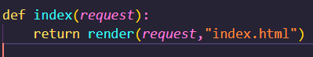
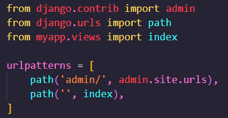

## PROJE OLUŞTURMAK
**django-admin startproject ilkproje** Komutu ile django projeminizin kurulumunu başlatabiliriz.

## VERİ TABANI OLUŞTURMAK
**python manage.py migrate** Komutu bizler için projenin veri tabanını oluşturur.

## APP DOSYASINI OLUŞTURMAK
**python manage.py startapp myapp** Komutu ile App dosyasını oluşturun.

1. Settings.py dosyasında INSTALLED_APPS alanına kurduğumuz myappi tanıtın.

2. myapp klasörü içerisinde **templates** adında bir klasör açın. İçerisinde index.html dosyasını açın.

3.views.py dosyasında index sayfanız için ilk fonksiyonunuzu yazın.  

4.urls.py dosyası içerisinde urlpatterns içerisinde ise yeni bir path ekleyerek indexinizi çekin.
**from myapp.views import index** myapp içerisinden index fonksiyonunu çekmeyi unutmayın!  

