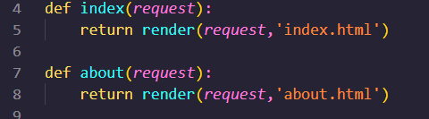
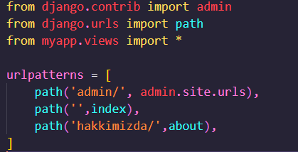
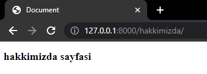
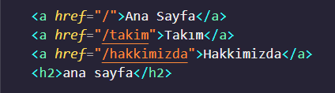
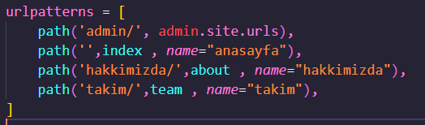
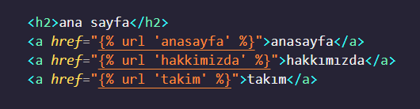
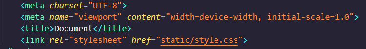

## İLK PROJE
İlk proje adımlamalara göre ilerlendiğinde oluşturulur.

## FARKLI SAYFALAR NASIL OLUŞTURULUR ? 
İşin temelinde index.html nasıl oluşturulup tanımlanıyor ise farklı sayflarda aynı mantıkla oluşturulup yönlendirilir.

Örnek vermek gerkirse;
About sayfası için **views.py** içerisinde yeni bir fonksiyon oluşturulur.    
  

Oluşturulan about sayfası **urls.py** içerisinde yeni bir path olarak tanımlanır    
  

Artık url alanına /hakkimizda yazarak sayfaya ulaşabilirsin.   

## SAYFALAR ARASI GEÇİŞ NASIL SAĞLANIR ?
Sayfalar arası geçişte mantık çok basittir. 2 Farklı yol izlenilebilir;  
**1.Yol**
Doğrudan oluşturulan sayfalara href yoluyla dizine ulaşmak.   

**2.yol**
urls.py dosyasında name ile yolların isimleri tanımlanır. 
    

İstenilen sayfalar içerisinde ise yönlendirmeler ekte görüldüğü gibi yönlendirilir  

## STYLE & JAVASCRİPT DOSYALARI NASIL TANIMLANIR
**static** adında bir klasör açılır  

Bu klasör içerisine istenilen css,js yada img dosyaları yerleştirilebilir.  
    

İkinci bir yol olarak da **** kullanılabilir. 
HTML girişinde **** yüklenilir ve head içersinde linkleme yöntemiyle css çekilir  

    
**Bu yapılan işlemler aynı mantıkla js dosyasıları içinde geçerlidir.**